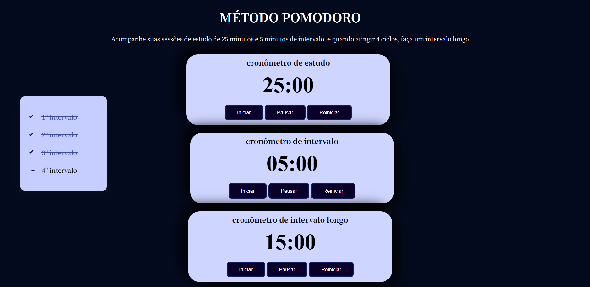
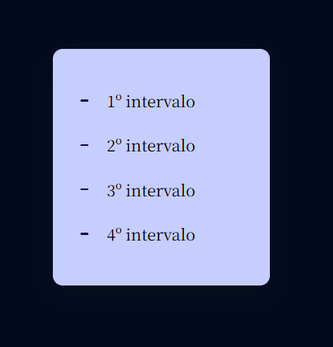

# Cronômetro de Estudo

Este projeto é um cronômetro baseado no Método Pomodoro para ajudar a gerenciar sessões de estudo. 

 
<h1>Funcionalidades</h1> 

- Marque o tempo de estudo, intervalo curto e intervalo longo com cronômetros.
- Utilize o checklist para acompanhar suas sessões concluídas.
- Receba notificações sonoras ao final de cada período.
- Interface intuitiva para facilitar a gestão do tempo.

<h1>Instruções de Uso</h1>

1. Clique no botão "Iniciar" para começar a contagem regressiva do cronômetro de estudo.
2. Quando o tempo de estudo terminar, clique em "Pausar" e depois em "Iniciar" para iniciar o intervalo curto.
3. Durante os intervalos, utilize os botões "Pausar" e "Reiniciar" conforme necessário.
4. Marque os intervalos concluídos utilizando o checklist.
5. Ao final dos 4 ciclos, faça um intervalo longo.
 

[Clique aqui para acessar!](https://lauluah.github.io/Metodo-Pomodoro)
